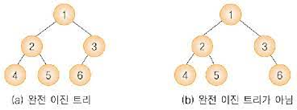

# Heap

> **Heap 정의**

다음 두가지를 만족할때 **Heap** 이라고 합니다.

* Complete binary tree
* Heap property

---

> **Complete binary tree**



그림 (a)와 그림 (b)의 공통점으로 각각의 노드들은 자식을 최대 2개까지 가질수 있다는 점입니다. 이러한 트리를 ***이진 트리(Binary tree)***라고 부릅니다.

이제 그림 (a)와 그림 (b) 각각을 살펴보겠습니다.

그림 (a)를 보면 트리의 같은 높이를 기준으로 왼쪽에서 오른쪽으로 노드들이 빽빽하게 채워져있는것을 알수 있습니다.

그림 (b)를 보면 제일 밑의 노드들을 보았을때 왼쪽부터 오른쪽으로 순서대로 노드들이 채워져 있지 않고 중간에 빠져있는것을 볼 수 있습니다.

그림 (a)와 같은 형태의 tree일때 ***완전 이진 트리(Complete binary tree)***라고 합니다.


> **Heap property**

Heap propery의 형태는 다음 두가지가 있습니다.

* Max heap property
* Min heap property

Min heap property는 Max heap property의 정반대이므로 해당 글에서는 Max heap property로만 설명을 진행하도록 하겠습니다.


Max heap property란 부모 노드의 값이 자식노드들의 값보다 크거나 같을 경우를 뜻합니다. 

그림에서 보는것과 같이 루트 노드의 값은 왼쪽 자식 노드의 값(89)과 오른쪽 자식 노드의 값(70) 보다 큰것을 확인할수 있습니다.

루트 노드외의 다른 모든 부모노드들을 확인하더라도 자식노드들의 값보다 크거나 같은 값을 가지는것을 확인할수 있습니다. 

이러한 형태를 가지는 tree를 ***Max heap property***를 만족한다라고 말할수 있습니다.

---

> **Complete binary tree와 일차원 배열**


완전 이진 트리는 위의 그림과 같이 일차원 배열로 표현할수 있습니다. 

하지만 완전 이진 트리를 일차원 배열로 표현하게 되면 한가지 문제점이 발생할수 있습니다. 언뜻보기에 트리상의 부모노드와 자식노드와의 관계가 유실되는것 처럼 보입니다. 그러나 그림을 잘 보시면 부모노드와 자식노드 index의 규칙성을 발견할수 있습니다.

부모노드의 index가 **i**라면 왼쪽 자식노드의 index는 **2*i**, 오른쪽 자식노드의 index는 **2*i+1**이 된다는 사실을 어렵지 않게 알수 있습니다. 또한 반대로 자식노드 index를 나누기 2한 결과가 부모노드의 index가 된다는 사실도 알수 있습니다. (여기서 오른쪽 자식노드의 index는 나누기 2한 결과에 소수점을 버립니다.)

> **MAX-HEAPIFY**


MAX-HEAPIFY란 왼쪽 Sub tree와 오른쪽 Sub tree 각각이 max heap property를 만족할때 부모 노드를 포함한 tree를 max heap으로 만드는 연산입니다. 


MAX-HEAPIFY의 과정은 위의 그림과 같습니다. 그림 (a)에서 루트노드를 제외한 즉, 루트노드의 왼쪽 sub 트리와 오른쪽 sub 트리는 모두 max heap을 만족합니다. 따라서 루트노드를 포함한 tree를 max heap를 만족하기 위해서 루트 노드에서 부터 max heapify를 시작합니다. 자식노드의 값중에 제일 큰 값과 부모노드(여기선 루트노드 입니다.)의 값을 비교하여 부모노드보다 값이 큰 자식노드가 있다면 해당 자식노드와 부모노드를 교환합니다. 그림 (a)에서는 16을 가지는 노드와 교환하게 되는데 이때 15를 가지는 자식 노드의 입장에서는 자신보다 값이 더 큰 노드가 부모노드가 되므로 자신을 루트로 하는 tree는 여전히 max heap property를 만족하게 됩니다. 그다음 그림 (a)와 같이 그림 (b)에서도 마찬가지로 4와 8의 노드가 교환이 되고 최종적으로 그림 (c)의 전체 tree는 max heap property를 만족하게 되며 MAX-HEAPIFY 연산은 종료됩니다.

> **MAX-HEAPIFY 시간 복잡도**

MAX-HEAPIFY의 시간복잡도는 결국 tree의 높이에 비례하게 된다는 사실을 쉽게 알수 있습니다. 따라서 tree의 높이를 h라고 했을때 시간복잡도는 O(h)가 됩니다. 높이 h일때 노드의 최대 갯수 N은 2^h-1가 되고 h=logN이 되므로 O(logN)의 시간복잡도를 가지게 됩니다.


> **MAX-HEAPIFY Java code**

``` java
void maxHeapify(int[] array, int parentIndex, int size) {
        if(isThereNoChild(parentIndex, size))
            return;

        int biggestChildIndex = getBiggestChildIndex(array, parentIndex, size);

        if(isMaxHeap(array,parentIndex,biggestChildIndex))
            return;

        swap(array, parentIndex, biggestChildIndex);
        maxHeapify(array, biggestChildIndex, size);
    }

    private boolean isMaxHeap(int[] array, int parentIndex, int biggestChildIndex) {
        return array[parentIndex] >= array[biggestChildIndex];
    }

    private void swap(int[] array, int parentIndex, int biggestChildIndex) {
        int temp = array[parentIndex];
        array[parentIndex] = array[biggestChildIndex];
        array[biggestChildIndex] = temp;
    }

    private int getBiggestChildIndex(int[] array, int parentIndex, int size) {
        if (parentIndex * 2 + 1 <= size)
            return array[parentIndex * 2] > array[parentIndex * 2 + 1] ? parentIndex * 2 : parentIndex * 2 + 1;

        return parentIndex * 2;
    }

    private boolean isThereNoChild(int index, int size) {
        return index * 2 > size;
    }
```

---

# Heap Sort

> **Max Heap Build**


초기의 배열은 정렬뿐만 아니라 heap property 조건또한 만족하지 못합니다. 

따라서 Heap Sort를 하기전에 Heap property를 만족하기 위하여 heapify 연산을 수행해야 합니다. 

제일 마지막 노드부터 루트 노드까지 각각의 노드에 대하여 heapify 연산을 통해 전체 tree를 heap으로 만듭니다.

해당 과정은 앞선 Heap 구조에 대한 글을 보셨으면 이해하기 쉬울것이라 생각하며 자세한 설명은 생략하겠습니다.


> **Heap Sort**

Max Heap에서 중요한 성질중 하나는 루트노드의 값이 제일 큰값을 가진다는 사실입니다. 

Heap sort는 해당 성질을 이용하여 정렬하는 정렬 알고리즘입니다. 아래의 첫번째 그림에서 루트노드의 값 16이 제일 큰값이기 때문에 해당노드를 제일 마지막노드인 1과 교환합니다. 16을 가지는 노드의 입장에서는 원래의 자리(제일 큰값이기 때문에 배열 인덱스상 제일 마지막 위치)로 배치된 격이기 때문에 해당 노드는 정렬이 완료된것으로 간주하여 정렬과정에서 제외시킵니다. 이후에 tree의 상태는 루트노드의 값이 바뀌었기 때문에 heap property를 만족하지 못할수도 있습니다. 따라서 루트노드에 대해 heapify 연산을 진행합니다. 이러한 과정을 반복적으로 진행하여 정렬된 값을 얻을수 있습니다. 

과정을 정리하자면 아래와 같습니다.

1. 루트노드와 마지막 노드를 교환합니다.
2. 새롭게 바뀐 마지막노드를 정렬과정에서 제외시킵니다.
3. 새롭게 바뀐 루트노드에 대하여 heapify 연산을 수행합니다.
4. 1번부터 3번까지 정렬이 끝날때까지 반복합니다.


* Max heap property를 만족하는 tree


* 16과 1 교환 (16은 정렬이 완료되어짐)


* 루트노드의 1에 대하여 heapify 연산 수행


* 14와 1 교환 (14는 정렬이 완료되어짐)


* Heap Sort 결과


> **Heap Sort 시간복잡도**

Heap Sort의 시간복잡도는 heapify의 연산 수행횟수에 비례하게 됩니다.

전체 노드의 갯수가 N이라면 heapify는 총 N(사실은 N-1번)번 수행하기 때문에 시간복잡도 ***O(NlogN)***이 됩니다.


> **Heap Sort Java code**

```java
void heapSort(int[] array, int size) {
        for (int i = size / 2; i >= 1; i--)
            maxHeapify(array, i, size);

        int treeSize = size;
        while (treeSize!=1) {
            swap(array, 1, treeSize);
            treeSize--;
            maxHeapify(array, 1, treeSize);
        }
    }

    void maxHeapify(int[] array, int parentIndex, int size) {
        if(isThereNoChild(parentIndex, size))
            return;

        int biggestChildIndex = getBiggestChildIndex(array, parentIndex, size);

        if(isMaxHeap(array,parentIndex,biggestChildIndex))
            return;

        swap(array, parentIndex, biggestChildIndex);
        maxHeapify(array, biggestChildIndex, size);
    }

    private boolean isMaxHeap(int[] array, int parentIndex, int biggestChildIndex) {
        return array[parentIndex] >= array[biggestChildIndex];
    }

    private void swap(int[] array, int parentIndex, int biggestChildIndex) {
        int temp = array[parentIndex];
        array[parentIndex] = array[biggestChildIndex];
        array[biggestChildIndex] = temp;
    }

    private int getBiggestChildIndex(int[] array, int parentIndex, int size) {
        if (parentIndex * 2 + 1 <= size)
            return array[parentIndex * 2] > array[parentIndex * 2 + 1] ? parentIndex * 2 : parentIndex * 2 + 1;

        return parentIndex * 2;
    }

    private boolean isThereNoChild(int index, int size) {
        return index * 2 > size;
    }
```

---

# Priority Queue

> **Maximum Priority Queue**

최대 우선순위 큐 (Maximum Priority Queue)는 다음의 두 가지 연산을 지원하는 자료구조입니다.

* insert(x): 새로운 원소 x를 삽입
* extractMax(): 최대값을 삭제하고 반환

최대 우선순위 큐는 Max heap을 이용하여 구현하기 때문에 heap 자료구조와 굉장히 밀접한 관계에 있습니다.

따라서 우선 순위 큐 자료구조를 이해하기 위해서는 heap 자료구조에 대한 이해가 선행되어야 합니다.


> **insert(x)**


새로운 값 15를 최대 우선순위 큐에 저장하는 연산 insert(15)의 과정은 위의 그림을 통해 쉽게 이해할수 있습니다.

먼저 마지막 위치에 새로운 값 15를 추가합니다. 새롭게 추가된 노드와 부모노드 사이를 제외하고는 heap property를 만족하기 때문에 두 노드를 비교하여 새롭게 추가된 노드가 부모노드 보다 크다면 서로 교환합니다. 위의 그림에서는 새롭게 추가된 노드(15)가 부모노드(7)보다 크므로 교환하게 됩니다. 그 다음 다시 15와 그 부모노드인 10을 제외하고는 모두 heap property를 만족하므로 15와 10(부모노드)을 비교하여 똑같이 교환과정이 이루어집니다.

과정을 정리하면 아래와 같습니다.

1. 새롭게 추가하는 노드를 tree의 마지막 위치에 insert 합니다.
2. 새롭게 추가된 노드와 그의 부모노드를 비교하여 부모노드보다 값이 크다면 교환합니다.
3. 새롭게 추가된 노드가 부모노드보다 작거나 같거나 루트까지 다다르면 과정을 종료합니다.


> **insert(x) 시간복잡도**

최대 리프노드로부터 루트노드로까지 비교연산과 교환과정이 이루어지므로 시간복잡도는 tree의 높이 h에 비례하여 **O(h)**가 됩니다. 높이 h만큼의 full binary tree의 총 노드갯수 n은 2^h-1 = n 이므로 ***O(logN)***이 됩니다.


> **extractMax()**


extractMax()는 최대값을 뽑아내는 연산으로 루트노드의 값을 취하게 됩니다. 위의 그림에서는 최대값이 20이 되겠습니다. 그 다음 마지막 노드 7을 새롭게 루트노드로 대체하게 되는데 이때 tree를 보았을때 루트노드의 왼쪽 sub tree와 오른쪽 sub tree는 heap property를 만족하지만 루트노드에 대해서는 만족하지 못하기 때문에 heap 자료구조를 유지하기 위해서는 루트노드에 대해서 heapify 연산을 수행해야 합니다. 

과정을 정리하면 아래와 같습니다.

1. 최대값인 루트노드의 값을 추출하고 마지막노드를 새롭게 루트노드로 대체시킵니다.
2. 루트노드에 대하여 heapify 연산을 수행합니다.


> **extractMax() 시간복잡도**

루트노드 추출 하는데 필요한 시간 O(1), 마지막 노드를 새롭게 루트노드로 대체시키는데 필요한 시간 O(1) 마지막으로 루트노드에 대하여 heapify하는데 필요한 시간 O(logN)이므로 전체 시간복잡도는 ***O(logN)***이 됩니다.


> **insert(x)와 extractMax() Java code**

```java
import java.util.Arrays;

public class MaxPriorityQueue {

    private int[] datas = new int[100];
    private int size = 0;

    public MaxPriorityQueue() {
    }

    public MaxPriorityQueue(int[] initialDatas) {
        this.datas = initialDatas;
        size = initialDatas.length - 1;
    }

    public void insert(int data) {
        size++;
        datas[size] = data;
        int i = size;
        while (!isRootNode(i) && datas[getParentIndex(i)] < datas[i]) {
            swap(getParentIndex(i), i);
            i = getParentIndex(i);
        }
    }

    public int extractMax() {
        int maxValue = datas[1];
        swap(1, size);
        size--;
        maxHeapify(1);

        return maxValue;
    }

    private void maxHeapify(int index) {
        if (isThereNoChild(index))
            return;

        if (isMaxHeap(index))
            return;

        int biggestChildIndex = getBiggestChildIndex(index);
        swap(index, biggestChildIndex);
        maxHeapify(biggestChildIndex);
    }

    private int getParentIndex(int i) {
        return i / 2;
    }

    private boolean isRootNode(int i) {
        return i == 1;
    }

    private void swap(int aIndex, int bIndex) {
        int temp = datas[aIndex];
        datas[aIndex] = datas[bIndex];
        datas[bIndex] = temp;
    }

    private boolean isMaxHeap(int parentIndex) {
        return datas[parentIndex] >= datas[getBiggestChildIndex(parentIndex)];
    }

    private int getBiggestChildIndex(int parentIndex) {
        if (parentIndex * 2 + 1 <= size)
            return datas[parentIndex * 2] > datas[parentIndex * 2 + 1] ? parentIndex * 2 : parentIndex * 2 + 1;

        return parentIndex * 2;
    }

    private boolean isThereNoChild(int index) {
        return index * 2 > size;
    }
}

```


